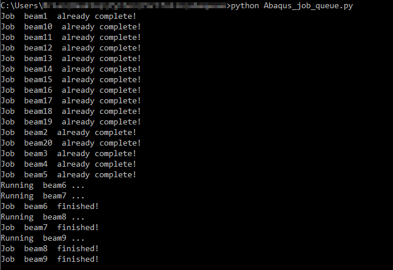

# Abaqus job queue manager
This Python script controls the submission of Abaqus jobs contained in a directory.  The script is set up to be run all jobs from scratch, or resume simulation if some jobs have completed. All of the Abaqus input decks in a directory are appended to a queue if they have not been run successfully.  The jobs are then submitted in parallel, up to the number of allowed simultaneous jobs.  Once a job completes, a new one is submitted, until they have all been submitted.  Customization of the Abaqus command is allowed.  The number of CPUs and the number of simultaneous jobs may be configured as well.  The "timedelay" should be updated to ensure enough time is allowed for Abaqus to generate a .lck file when the simulation starts.  Otherwise, more than njobs may run at once.

  
<picture>
 <source media="(prefers-color-scheme: dark)" srcset="Output.png">
 <source media="(prefers-color-scheme: light)" srcset="Output.png">
 
</picture>

