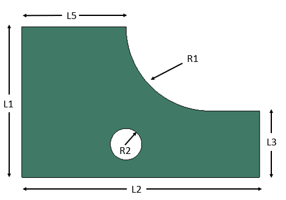

# FEA Surrogate Demonstration

### This FEA Surrogate example goes through the steps of: 

#### Defining parameter definitions and parameter sets for model generation
<code>Generate_TrainingModels.ipynb</code>
The parametric model defintion is shown below.  Random number generators select the dimensions within specified ranges and conforming to uniform distributions.  THe model definitions are saved to a CSV file.

  
#### Creating a parametric FEA model with Abaqus scripting in Python
<code>beamscript.py</code>

*Note, the FEA models are limited to 1000 nodes, so Plane Stress assumptions and coarser meshes are used.*

    
#### Solving the models and extracting stress results
*See the Abaqus_queue folder for the script.
Jobs are submitted two at a time, until all have been solved.
     
#### Processing stresses to get uniform locations
<code>ExtractStress.py</code> 

     
#### Training a Neural Network and checking the results
<code>Normalize_and_Train.ipynb</code>

