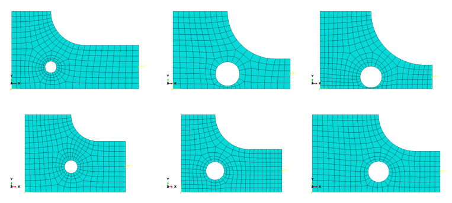

# FEA Surrogate Demonstration
FEA Surrogate Neural Networks take some work to set up, but they can provide tremendous speed improvement compared to traditional FEA.  That said, there are certain times when Surrogates are worth the effort, including when:
- A closed form solution does not exist
- The error introduced is acceptable
- The Surrogate will be excercised numerous times
- The rapid evaulation of the Surrogate saves meaningufl time over FEA iterations

When set up well, FEA surrogates provide an excellent way to explore design spaces, and can dramatically speed up design optimation by replacing FEA.

### This FEA Surrogate example goes through the steps of: 

#### Defining parameter definitions and parameter sets for model generation
<code>Generate_TrainingModels.ipynb</code>
The parametric model defintion is shown below.  This Jupyter Notebook uses random number generators to select the dimensions within specified ranges, conforming to uniform distributions.  The model definitions are saved to a CSV file.

  
#### Creating a parametric FEA model with Abaqus scripting in Python
<code>beamscript.py</code>

*Note, the FEA models are limited to 1000 nodes, so Plane Stress assumptions and coarser meshes are used.*

This Python script runs Abaqus CAE and creates the training FEA models from the model definition CSV file.  The script creates geometry, defines a material, applies loads and boundary conditions, and creates a mesh with specified refinement.  The script writes the Input Decks and saves the CAE file.  Example training models are shown below.  

Each model has the same downward load applied to the right edge of the geometry, and has the left edge fixed.

    
#### Solving the models and extracting stress results
*See the Abaqus_queue folder for the script.*

Jobs are submitted two at a time, until all have been solved.
     
#### Processing stresses to get uniform locations
<code>ExtractStress.py</code> 
Stress results are saved in Odb files.  The Element Nodal stresses are averaged to get Nodal stresses.  Then, stresses for nodes in the fillet and nodal coordinates are written to another CSV file.  

     
#### Training a Neural Network and checking the results
<code>Normalize_and_Train.ipynb</code>
Since the Neural Network requires consistent input and output, the stresses are interpolated to a set number of points along a path in the fillet.  See the contour plot above for the path definition.  For each model, a SciPy 1d interpolator is fit to the stress along the fillet, shown above.  The stress is then interpolated to 50 evenly spaced points along the path and used for training outputs.

Additional Features are created from the model dimensions, including the Ligament thickness, the length of the beam beyond the fillet, and ratios of L3/L1, R1/R2, and R1/L1.  The Neural Network is trained and plots are created to check the accuracy of the predictions.

Now that the FEA Surrogate is trained, it may be used to search the design space by evaulating grids of design points, or included in an optimization routine, such as **scipy.optimize.minimize**.  For example, I have used scipy.optimize.minimize to minimize an assembly's weight, with a FEA Surrogate model that provided input to a stress constraint.  This allowed system-level refinement during a preliminary design phase that would not have been possible with traditional FEA.

