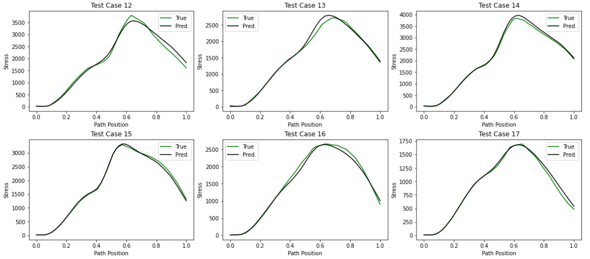

# FEA Surrogate Demonstration
This example demonstrates the prediction of stresses in a region of a beam with a stress concentration and a nearby hole subjected to bending.  The hole interacts with the stress concentration. Both geometries by themselves are similar to examples in Roark or Peterson, but the interaction adds complexity.  The example attempts to train a neural network to learn the interaction behavior.  Very similar neural networks are built with <b>TensorFlow</b> and <b>PyTorch</b>.

FEA Surrogate Neural Networks take some work to set up, but they can provide tremendous speed improvement compared to traditional FEA.  That said, there are certain times when Surrogates are worth the effort, including when:
- A closed form solution does not exist
- The error introduced is acceptable
- The Surrogate will be exercised numerous times
- The rapid evaluation of the Surrogate saves meaningful time over FEA iterations

When set up well, FEA surrogates provide an excellent way to explore design spaces, and can dramatically speed up design optimization by replacing FEA.

### This FEA Surrogate example goes through the steps of: 

#### Defining parameter definitions and parameter sets for model generation
<code>Generate_TrainingModels.ipynb</code>

The parametric model definition is shown below.  This Jupyter Notebook uses random number generators to select the dimensions within specified ranges, conforming to uniform distributions.  The model definitions are saved to a CSV file.

  
#### Creating a parametric FEA model with Abaqus scripting in Python
<code>beamscript.py</code>

*Note, the FEA models are limited to 1000 nodes, so Plane Stress assumptions and coarser meshes are used.*

This Python script runs Abaqus CAE and creates the training FEA models from the model definition CSV file.  The script creates geometry, defines a material, applies loads and boundary conditions, and creates a mesh with specified refinement.  The script writes the Input Decks and saves the CAE file.  Example training models are shown below.  

Each model has the same downward load applied to the right edge of the geometry, and has the left edge fixed.

    
#### Solving the models and extracting stress results
*See the [Abaqus_queue folder](https://github.com/brians1982/portfolio/tree/main/Abaqus_queue) for the script.*

Jobs are submitted two at a time, until all have been solved.
     
#### Extracting stresses and performing nodal averaging
<code>ExtractStress.py</code> 

Stress results are stored in Odb files.  The Element Nodal stresses are averaged to get Nodal stresses.  Then, stresses for nodes in the fillet and nodal coordinates are written to another CSV file.  

     
#### Stress interpolation to uniform locations, Neural Network training, and model evaluation

Note: The examples here use interpolation to create targets with consistent lengths for disimilar meshes.  An alternative approach is to add the distance parameter along the fillet as an input, and predict output(s) corresponding to that location.

<code>Normalize_and_Train.ipynb</code> and <code>Normalize_and_Train_PyTorch.ipynb</code> TensorFlow and PyTorch implementations of very similar neural netorks.

Since the Neural Network requires consistent input and output, the stresses are interpolated to a set number of points along a path in the fillet.  See the contour plot above for the path definition.  For each model, a SciPy 1d interpolator is fit to the stress along the fillet, shown above.  The stress is then interpolated to 50 evenly spaced points along the path and used for training outputs.

Additional Features are created from the model dimensions, including the Ligament thickness, the length of the beam beyond the fillet (L5), and ratios of L3/L1, R1/R2, and R1/L1.  The Neural Network is trained and plots are created to check the accuracy of the predictions.

Now that the FEA Surrogate is trained, it may be used to search the design space by evaluating grids of design points, or included in an optimization routine, such as **scipy.optimize.minimize**.  For example, I have used scipy.optimize.minimize to minimize an assembly's weight, with a FEA Surrogate model that provided input to a stress constraint.  This allowed system-level refinement during a preliminary design phase that would not have been possible with traditional FEA.

#### References
- Saaedi, Mehrdad. Predicting the Cancer Tumor Position in Liver Using Finite Element Analysis (FEA) and Artificial Intelligence (AI). 2021.
- Géron, Aurélien. Hands-on Machine Learning with Scikit-Learn, Keras and TensorFlow: Concepts, Tools, and Techniques to Build Intelligent Systems. 2nd ed., O’Reilly, 2019.
- ABAQUS/Standard User’s Manual, Version 2023. Dassault Systemes Simulia Corp, United States, 2023.
