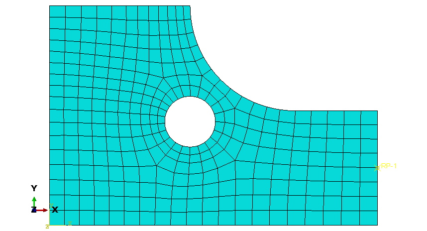
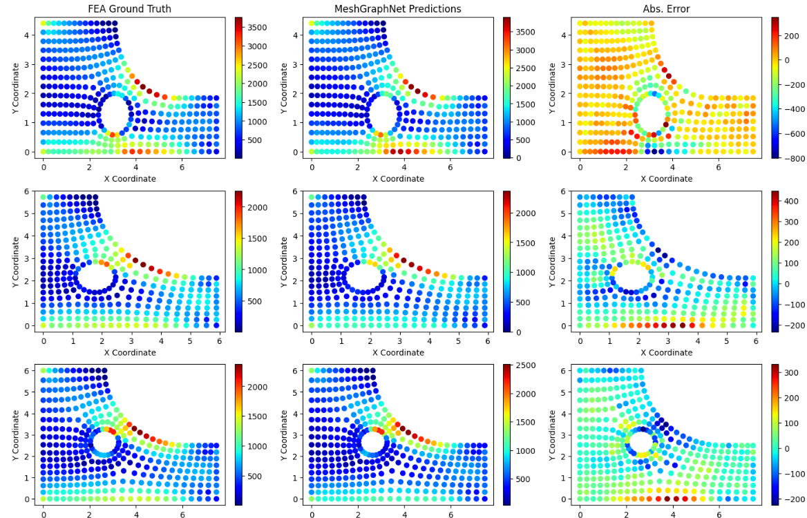

# FEA Surrogate Demonstration with a MeshGraphNet

This example adapts the MeshGraphNet framework from this Medium article, [Learning Mesh-Based Flow Simulations on Graph Networks](https://medium.com/stanford-cs224w/learning-mesh-based-flow-simulations-on-graph-networks-44983679cf2d) for prediction of multiple stress components on disimilar meshes.

Data for the MeshGraphNet is prepared using notebook <code>Graph_DataPrep.ipynb</code>.  The ground truth data is taken from the [parametric model](https://github.com/brians1982/portfolio/tree/main/FEA_Surrogate) used in other surrogate models.  The FEA mesh information is adapted to vertex and edge attribute definitions, and a vertex connectivity definition.  Additional features, such as vertex distance to the nearest edge, are also calculated as attributes.  The data is written to a PyTorch Geometric data entity for use by the MeshGraphNet.

The vertex and edge definitions follow the original mesh, such as this example:

The MeshGraphNet is updated to produce four outputs for component stresses S11, S22, S12, and the Von Mises stress.  I also use a Custom Loss Function to create a physics-based constraint: the Von Mises stress represents a combination of S11, S22, and S12.  Notebook <code>GNN_Surrogate.ipynb</code> contains the dataloading, model setup, training, and assessment against test data.

