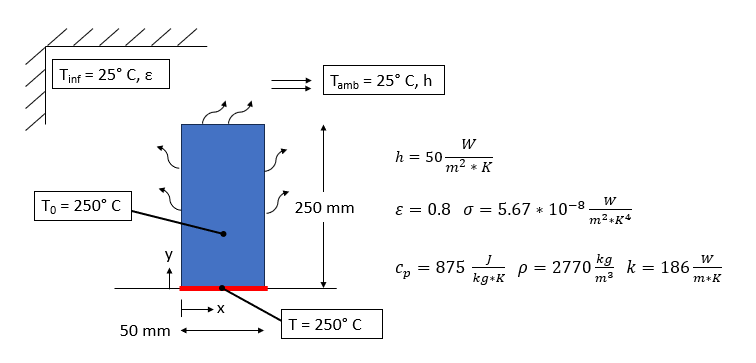
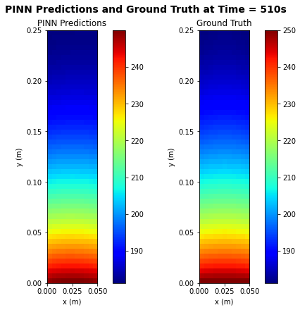

# Heat Transfer Physics Informed Neural Network Example

<code>HT_PyTorch.ipynb</code> is a Jupyter Notebook that contains the setup and evaluation of a Physics Informed Neural Network trained to predict the temperature evolution of a fin, with heat transfer laws determining part of the training loss in each epoch.

