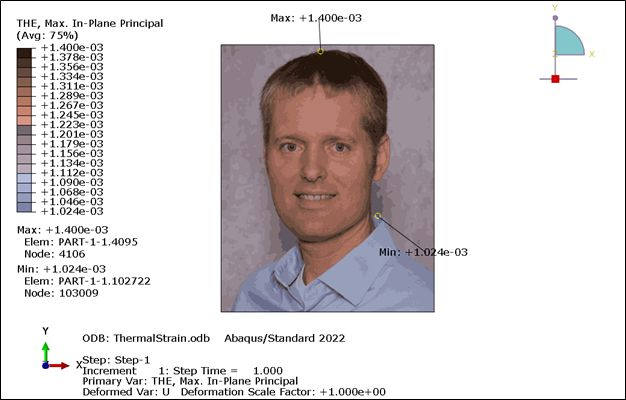

# Convert an Image into an Abaqus Contour Plot
Recently, I saw somebody convert their LinkedIn profile picture into a mesh, so I decided to make an Abaqus contour plot using my profile picture. 

I started by using the KMeans Clustering routine in SciKit-Learn to group regions of the image with similar colors. The 17 clusters in the image (I like prime numbers) also define regions of the FE model for material property assignments. These regions will be displayed differently in contour plots when loads or temperatures are applied, based on their material properties. I defined material properties so that each cluster generates a specific result on the custom contour scale that matches the original image color. The custom contour scale is tied back to the cluster centers (red, green, blue values). I tried to choose a (somewhat) logical progression of contour colors, based on cluster RGB values and R-G-B ratios. A different image may require different logic.

For a complicated model, I could have used Abaqus scripting, but this input deck is straightforward, so I generated it directly with Python. I did not explore remeshing an Orphan mesh either – maybe next time. I also generated the Abaqus Viewer Session commands for the custom contour scale, for easy contour plot creation.

