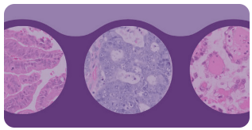

**Kaggle Competition - UBC OCEAN Ovarian Cancer Subtype Classification**

[UBC Ocean Contest Description](https://www.kaggle.com/competitions/UBC-OCEAN)

This Kaggle challenge had contestants develop a medical image classifier to identify ovarian cancer subtypes using images of tissue on slides.  Prior to training a neural network, tiles had to be generated from the slide images.  These notebooks are my submission to the contest.  My best submission scored in the top half of contestants.  

1. <code>imageprep-07.ipynb</code> Notebook that locates and saves pertinent image tiles.
2. <code>balance-07.ipynb</code> Notebook augments dataset while balancing classes.
3. <code>tl-gpu-072.ipynb</code> Notebook that finetunes an EfficientNet Convolutional Neural Network.
4. <code>inference-tlgpu072.ipynb</code> Notebook that performs inference on the Kaggle Test dataset.
