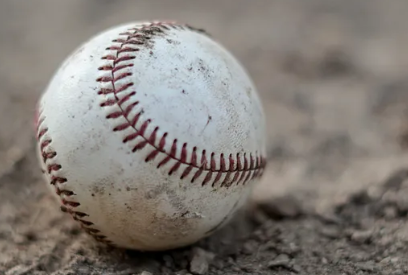

**Pitch Prediction with a Neural Network**

I originally published an article on Medium about this project [here.](https://medium.com/@bshula/pitch-prediction-with-machine-learning-bb1fd8dbb0ee)  Since then, I streamlined the code for this example.  

In this example, I create a Neural Network that predicts what type of pitch will be thrown by a pitcher for different situations in a baseball game.  I used about three years of prior pitch/situation data to train my model.  I convert the game data into numerical and categorical features useful to a Neural Network, and create some features from combinations of existing features.  Finally, I balance the classes in the dataset by repeating observations (interpolation to create new observations is not valid), so that each class is represented equally in batches during training.  I am able to achieve about 70% accuracy in predicting the next pitch with the model presented.  This may seem low, but professional pitchers earn their paychecks by being unpredictable :)

