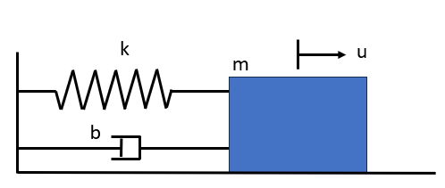

# Physics Informed Neural Network of a Spring-Mass-Damper System
The spring-mass-damper system is described by a second order ODE.  This example is from Boyce and DiPrima - Elementary Differential Equations 
and Boundary Value Problems, 7th Edition, Section 3.8, Example 3.

Consider a spring-mass-damper system described by:

u'' + 0.125u' + u = 0,

where m = 1.0 lb and k = 1 lb/ft.

Initial Conditions:

u(0) = 2, u'(0) = 0
### Model Setup and Evaluation 
<code>Spring_Mass_TensorFlow.ipynb</code> contains the PINN set up using <b>TensorFlow</b>.

<code>Spring_Mass_PyTorch.ipynb</code> contains the PINN set up using <b>PyTorch</b>.

