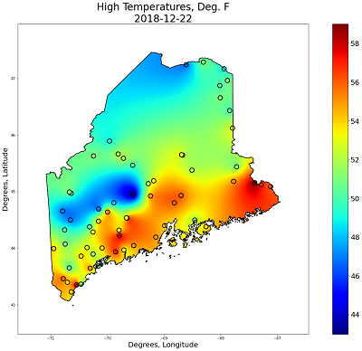

**Temperature Plotting**

I have been interested in the weather for as long as I can remember.  I considered studying meteorology in college, but opted for mechanical engineering instead.  This example creates a contour plot of archived temperature readings on a map of Maine.

The National Weather Service archives weather observations at numerous locations around the United States every day.  The data is accessible via an [API](https://www.ncdc.noaa.gov/cdo-web/webservices/v2) using the Python Requests libary and an API key.
In this example, maximum temperature data is retrieved for specific dates for the state of Maine, and plotted within state boundaries.

First, API queries are made to determine which weather stations are active on the date range of interest.  Then, the maximum temperature is requested for those dates.  The station latitude/longitude and temperature reading are fed to a Radial Basis Function Interpolator in the SciPy library.  This allows interpolation from an unstructured dataset (arbitrary locations) to a structured grid for the final plot.  The state outline is obtained by reading a Shape file.  The grid temperature data and the state of Maine outlines are overlaid using Matplotlib, so that data is only plotted over land within the state, and not over the ocean or in New Hampshire/Canada.

