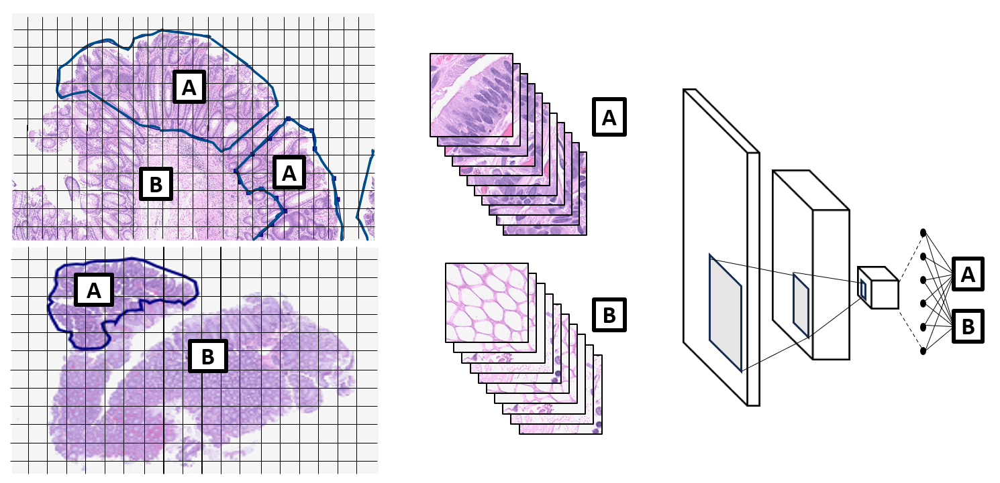
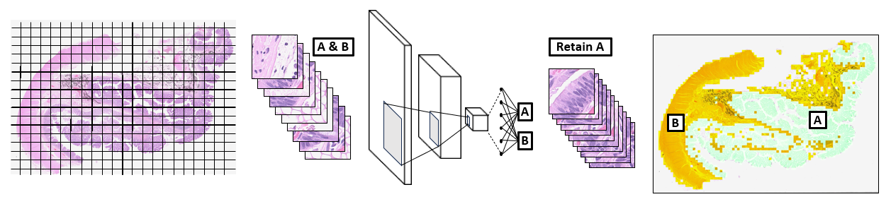

# Tubular Adenoma Research Project: Combining Computer Vision Models and Digital Pathology

Check out our first preprint [here](https://arxiv.org/abs/2508.09339)! Another is anticipated later in 2025 - stay tuned!

##

## Dataset Creation: My contribution

I created the labeled dataset for this research project.  I was provided about 450 gigapixel-sized Whole Slide Images (WSIs) split between a Control set and a Case set.  I was also provided about 20 WSIs that had regions of relevant tissue annotated.  In order to extract the relevant tissue from the entire dataset efficiently, I trained a convolutional neural network (CNN) to identify whether a sample of tissue was relevant to the study or not.  

### Training:

I extracted tiles from the annotated WSIs for both classes and determined whether they contained tissue using thresholding - many are just whitespace. Relevant regions were identified by a vector-based polygon, so I then checked whether a tile intersected the polygon(s) to determine if it was relevant or not.  Finally, I trained an EfficientNetV2S CNN on the relevant vs. non-relevant classes.

 

### Processing:

Once the relevant tissue classifier was trained, I processed the remaining WSIs to generate a set of tiles for each WSI.  I extracted tiles from each WSI in a separate notebook, <code>ExtractTiles_blocks.ipynb</code> that did not require GPU resources.  This notebook creates a low-resolution mask using SciKit-Image for basic identification of regions that contain tissue.  Then additional checks are performed using thresholds on a low-resolution image of the WSI.  If a tile is deemed to have tissue, it is flagged to be retained, and its coordinates are recorded.  After the mask and low-resolution WSI image are screened, the tiles to be extracted are analyzed to find sections that are connected (this save significant time because resizing can be performed before extraction).  Then, the groups of tiles are processed using Parallel capabilities in the Python joblib library.  Individual tiles are saved from each group of tiles.  These steps resulted in a significant speedup from extracting a single full-size tile, then resizing it.

The tiles were then processed to determine whether they were relevant.  Notebook <code>Determine_Relevant_Tiles.ipynb</code> loads the CNN model and a ZIP of all of the tiles with tissue extracted from a WSI.  It then classifies tiles as relevant or not relevant, and discards the non-relevant tiles.  The notebook creates a summary image, like the ones below, showing the retained tiles (green) and the discarded tiles (yellow). The retained tiles were then combined into the Case and Control classes for our research project.

### Output Record

The images below are kept as a form of quality control.  The record of a tile and its coordinates is also updated to record whether a tile is relevant as well.

   
